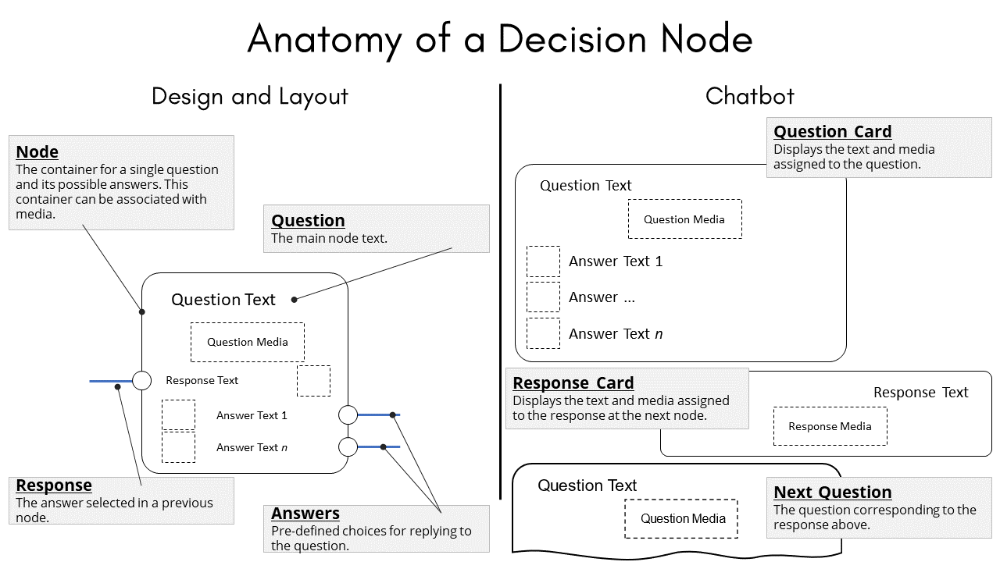

Anatomy of a Decision Node
==========================

Last updated by Daniel Patterson on November 16, 2020

Decision nodes are useful in building any of the following communication
scenarios.

-   Chatbot-based micro-learning.

-   Conversational training.

-   Just-in-time learning.

-   Prompted dialog.

-   Scenario-based training.

The following illustration describes the parts of a single decision node
and highlights how those parts are mapped to chatbot output.

