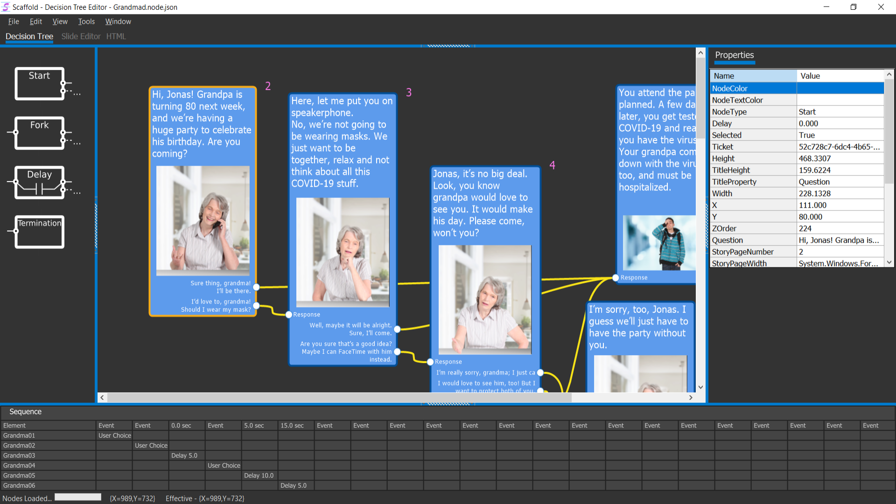
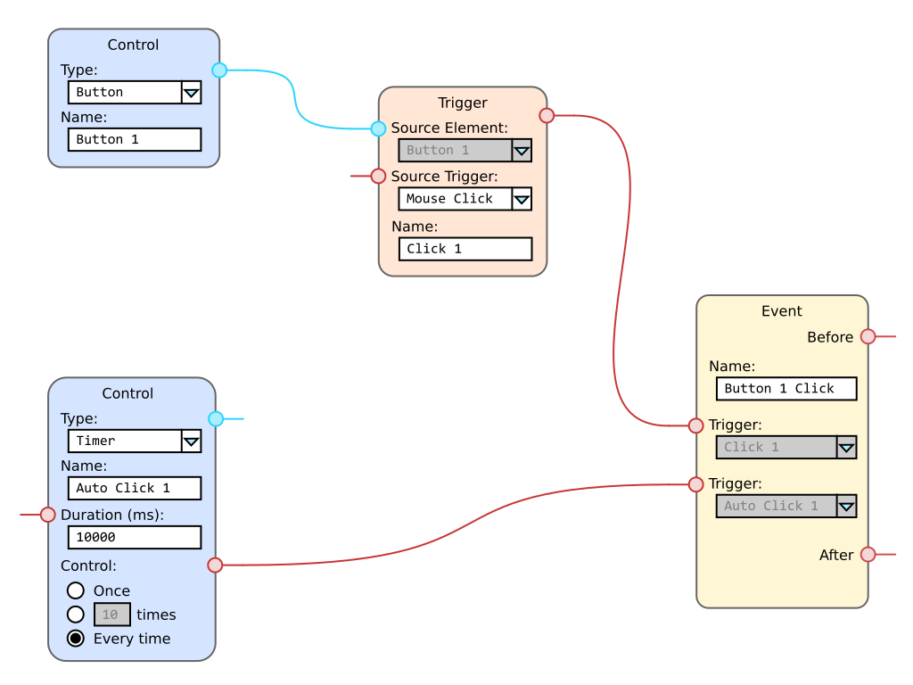

Scaffold
========

**Initial Vision Document**  
Last updated by Daniel Patterson, November 3, 2020

The purpose of this document is to provide the initial statement for the
project along with the needs of the user community that can lead to the
focused development of a base application with an original set of
features and components. The results of any existing observations and
research on standards are additionally included in this document to
provide a full picture from as many perspectives as possible.

The Need for a Fully Featured Instructional Design System
---------------------------------------------------------

At the time of this document, there are a few large and mature
e-learning authoring tools in the commercial market that produce
courseware output suitable for Learning Management Systems (LMSs). Aside
from having many of the advantages you would expect of professional
grade software, most of the systems are each generally perceived to have
one or more of the following disadvantages.

-   High bar of entry. All of the known commercial versions require a
    form of payment to get started in earnest. A trial period is
    typically provided, but at least one of the systems severely
    degrades quality of the media output on the demo version.

-   Questionable Return On Investment (ROI). The common pricing model of
    mature systems seems to be that of an ongoing subscription. When the
    user stops paying the monthly or yearly fee, as the case may be, the
    software becomes non-functional. To warrant keeping this software
    installed on your system, you will have to constantly be using it to
    create courses that directly generate revenue. To a freelance
    professional receiving perhaps one or two significant assignments
    per year, the yearly cost of the software makes a non-repetitive
    assignment hardly worth the effort.

-   Limited vision in the industry.

    -   Multiple people are expressing their desire to work with
        non-linear decks. It is clear to this contributor that the
        designer of the course should be able to create courses that are
        non-linearly adaptive to the learner.

    -   Even after responsive design has been a practical reality in the
        web industry for several years, e-learning authoring systems
        offer little in terms of smooth user interface across devices.

    -   There is a complete lack of attention to universally
        transferable learner transcripts.

The intention of this project is to provide, as closely as possible, the
same functionality found in commercial e-learning authoring tools
without introducing any of the disadvantages they currently present,
then to fill in the gaps the existing commercial systems are not
addressing.

Vernacular Of This Project
--------------------------

A number of specialized terms are used in this project.

-   **Control**. A user input or display element that can be placed on a
    page or within another parent control. See [Curriculum
    Hierarchy](#curriculum-hierarchy).

-   **Course**. The entire curriculum of a single course, which consists
    of at least one module (see [Curriculum
    Hierarchy](#curriculum-hierarchy)). A default module might or might
    not be defined by the designer, and if not, a default shadow module
    is used implicitly by the system.

-   **Designer**. The individual or team creating the content in the
    project.

-   **Element**. In this application, every object having a place in the
    user's object model is an element. For example, all of the following
    items are elements.

    -   Button.
    -   Control.
    -   Course.
    -   Event.
    -   Module.
    -   Panel.
    -   Page.
    -   Trigger.
    -   Unit.

-   **Event**. In a tangible sense, an event is typically something that
    happened. In this application, the event element is more specialized
    than that and is the handler and/or repeater for something that has
    happened. This system also has a type of element, known as a
    trigger, that is responsible for the signals that cause the events.
    Events might be triggered directly from system events such as
    clicking or moving the mouse, or by trigger elements defined by the
    designer. Any event can have multiple trigger inputs, and any event
    can also repeat its trigger signal to multiple other elements
    capable of receiving trigger signals, either before or after the
    local handling of the event in question has been completed.

-   **Learner**. The individual or group receiving the instruction.

-   **Module**. A single instructional module within the course (see
    [Curriculum Hierarchy](#curriculum-hierarchy)). In certain authoring
    applications, this is the outermost level of the project.

-   **Page**. Often referred to in the e-learning authoring tool
    industry as a *slide*, a more appropriate curriculative term might
    be a unit of *content*, but for now, this contributor is going to
    use *page* as the reference to a single slide to start getting away
    from the slideshow type of association traditional authoring tools
    share. See [Curriculum Hierarchy](#curriculum-hierarchy).

-   **Project**. The file container for the course and its elements.

-   **Trigger**. An element representing the signal coming from the
    system or other element that can be handled by an *event* element.
    In most general scenarios, an event is something that happened, and
    the trigger of the event is the stimulus that caused it. In this
    application, the trigger represents a specialized signal, while the
    event represents the place where a signal of that type is handled or
    forwarded to other handlers.

-   **Unit**. A single instructional unit within a module (see
    [Curriculum Hierarchy](#curriculum-hierarchy)). Sometimes referred
    to as a *deck* in the industry, this application chooses the name
    *unit* for establishing a direct curriculative reference. One unit
    can contain zero or more pages.

Figure - Scaffold Current UI Concept

Overview of Project Goals
-------------------------

Scaffold is an open source e-learning authoring tool meant to meet the
following goals.

-   Operate as a desktop application, avoiding internet dependencies
    except when collaborating in real-time.

-   Maintain 100% operational platform compatibility with Windows,
    Linux, and Mac.

-   Allow any element to work with any trigger / timeline combination
    under singular or cyclical conditions.

-   Allow the timeline of any element to be based upon global, course,
    module, page, or element timers, or in reference to a trigger.

-   Publish themed, responsive, accessible, interactive, animated,
    media-rich courseware presentation with touchscreen gesture support
    to learners on any device over any network, website, learning
    management system, or stand-alone pre-loaded offline file.

-   Provide methods by which learners on the system are able to transfer
    their transcripts from one system to another, without having access
    to modify their results or scores, such as might be implemented with
    the help of blockchain. For example, one learner works at a bank,
    which is heavily regulated, and requires several channels of
    continuous online training, depending upon their role. Upon moving
    to another bank completely unaffiliated with the first one, that
    learner needs to have a record of course history at the new bank.
    Otherwise, that learner will be required to retake a number of
    similar courses from a different LMS provider to become recertified
    to perform the job.

-   Provide methods by which a team of instructional designers can
    seamlessly collaborate with formal incremental, reversible change
    tracking during the development of a course through direct
    compatibility with the most widely accepted version management
    system.

-   Present enough of the user interface and functionality elements of
    any of the commercial systems that the user is intuitively familiar
    with the design environment on first use.

-   Provide a big-picture outline view that can be used to navigate to
    any part of the project from course to individual element.

-   Allow any element of the project to be selected, moved, copied,
    pasted, edited, or deleted from the outline view.

-   Provide a unique interactive wireframe or node-based sketching
    system by which designers can create the official storyboard for
    each course module that itself actively aids in the construction of
    the target course, thereby resulting in an extreme productivity gain
    over that possible in commercial systems.

-   Support any type of trigger on any object, leading to any type of
    defined reaction.

-   Support drag and drop and instant design activation of any object in
    the gallery.

-   Provide full support for linear and non-linear navigation with
    dynamic, adaptive behavior.

-   Provide onboard screen casting capability to allow designers to
    communicate and teach about the platform itself.

-   Support segments and groups of material that can be mixed and
    matched among multiple projects.

-   Support every modern type of image, audio, and video format,
    converting them to optimized web formats upon preview or
    publication.

-   Provide a wide variety of question types and assessment styles.

-   Allow activities and assessments to be randomized or adaptively
    progressive.

-   Support positive and negative scoring to discourage learner
    guessing.

-   Provide multiple application and document options for stakeholder
    routing, sign-off, and final approval / disproval on pages, modules,
    and courses.

-   Allow for synchronized, multi-language localization of all media
    types on every element.

-   Provide support for skipping / indexing in any direction at any
    location.

-   Provide support for community-based sharable library of theme
    templates, characters, images, vector art, icons, audio effects, and
    videos.

-   Provide support for in-course section navigation by name or number,
    and controllable by options.

-   Allow the designer to copy formatting elements of one or more
    objects to other elements.

-   Provide a wide variety of animation capabilities, including multiple
    point paths with Bezier curve characteristics.

-   Allow animations to occur on any trigger, including entrance, exit,
    and timer.

-   Allow the specifications of one animation to be reused by applying
    them to other objects. Allow the specification to occur in the form
    of a link to the original or a separate customizable copy.

-   Provide support for visual and audio transitions, controlled by
    triggers and timers.

-   Allow the properties of any element to be changed by a specified
    amount to, or to a specific value, as the result of a trigger or
    timer.

-   Allow a group of images, audios, or videos to be activated or
    controlled by definable set of triggers or timers.

-   Provide navigations to keyframes or scoped times based upon triggers
    or timers.

-   Provide support for triggers on object collision, drag start, drag
    end, and a number of other common movements.

-   Provide support for triggers at successful completion of page,
    module, and course.

-   Provide support for user-defined variables that can be used anywhere
    in a scope and can fire triggers at predefined settings.

-   Provide complete support for a scripting language such as JavaScript
    for creating advanced behaviors.

-   Provide direct support for at least the following standards.

    -   AICC.
    -   cmi5.
    -   SCORM.
    -   Tin Can API 1.0.
    -   WCAG.

A number of interactive element types can be supported on each page. In
the first version of the application, the following types should be
supported.

-   Buttons.
-   Checkboxes.
-   Embedded pages.
-   Hot spots.
-   Info boxes.
-   Mouse effects.
-   Panels.
-   Radio buttons.
-   Text labels.
-   Textboxes.

Curriculum Hierarchy
--------------------

The application follows a curriculum sensitive hierarchy with the
intention of allowing the project structure to fit accepted training
methodologies as closely as possible.

In the first version, the project will be capable of modeling a single
full course with child elements that are modular enough to be shared
among multiple courses.

Figure - Curriculum hierarchy base object model

Notice in the above figure that the Course object is the only one not
represented by a collection/member pair. For example, the modules
collection contains zero or more module objects and so on.

Component and Feature Enumeration
---------------------------------

The following set of initial required components and features expands
upon the general goals described above.

### Application Environment - Desktop Application

When working with creative material, the clear favorite for workspace
environment tends to be desktop application - even if that same
application happens to be available as an app for mobile devices. This
contributor also feels strongly in favor of that sentiment.

What's more is that although there will need to be plenty of attention
to seamless collaborative capabilities within teams, the application
itself should not be cloud-based, and should not rely on an internet
connection for any part of its operation other than transporting
discrete project updates to established team members, and providing
optional access to shared community assets and plug-ins.

Applications that rely fully on cloud operation, commonly referred to as
Software As a Service (SAS), suffer from the following issues, among
others.

-   Because of traceable visitor accesses to the projects and files, the
    SAS provider can gain direct access to basic contact information for
    your customer and can contact them directly in a competitive move.

-   With your entire projects stored in the SAS database, the provider
    has direct access to all of the creative content being produced, and
    can use slightly modified parts of that content to assure their own
    success in manners that compete directly in different segments of
    your own market.

-   When an unsuccessful software change is activated at the SAS data
    center, all of the users of the software are affected immediately
    and adversely. In many cases, even basic functionality is lost until
    the change is either rolled-back, or a solution to the new problem
    is found.

-   General activities like clicking on an object, changing a property
    value, or updating a view often have a tangible lagging user
    response, instead of the sharp, instantaneous response that is
    possible in well-written locally installed applications.

-   When your internet connection is slow, intermittent, or out of
    service, nobody in the office can do any work at all. When the
    software is being used directly in the service of live customers,
    all of the customers in queue also have to wait until the connection
    is restored, if ever.

Cross-platform functionality could also be a huge advantage to users.

A platform independent desktop platform like Electron has certain
advantages due to its web-oriented nature. However, Electron apps are
not only heavy in resources, but incredibly slow when compared to native
desktop applications.

To further complicate matters, the change Apple is making to adopt their
own microprocessors in the coming year will cause the differences
between PC and Mac to be more pronounced than they have been since the
1980s and no matter what the quality level of a C++ compiler,
differences always exist for applications compiled directly to
dissimilar hardware platforms.

Raising the code base to a universal UI level would alleviate all
hardware considerations for a type of software like this that needs no
hardware support other than accurate timers. The real challenge in this
elevation is to find code base that still provides exceptional
performance when running at such an abstracted level.

One possible direction is Progressive Web Apps (PWA) with WebAssembly
and .NET Blazor / Razor service logic.

This is context in which the first experimental exercises for this
project will be conducted.

### Events, Triggers, Timelines, Keyframes, And Elements

In this software, the term element is used to imply any 'thing' that
will be present in the course, including a background, sprite, button,
and even the timer used to keep the pace on another element.

A trigger is a signal that something has occurred, where an event
represents an implementation of behaviors or actions serving as the
response to something. A trigger is an input to one or more stimulus,
and an event can be set to react to one or more separate triggers, as
well as repeating the signal to other events. Triggers can be set to
fire once or every time the related stimulus occurs. A limited single,
infinite cyclical, or numbered sequence can be achieved through the use
of a timer control in the trigger chain. The timer control can generate
single shot, repeating, and counted triggers from a local delay or from
its own input trigger. See more about the timer control later in this
document.

The timeline is a singular universal concept representing the stream of
general time. All things occur along the same timeline, but the scope of
use can be focused at any level, from the time an element was shown to
the time the student has spent on all modules since the beginning of the
course. Keyframes are cue points that can be defined on any scope of the
timeline to annotate important milestones, synchronize content, or
trigger events.

### Universal Element Theming

A separated master theming configuration is preferred that allows the
designer to predefine or redefine all of the parts that would be
traditionally referred to as the master page. Unlike the concept of the
master page, however, the idea of cascading style sheets is added to
allow certain elements to have multiple different styles that each come
into play in different relations to the elements around them and how
they are being used.

The designer should also be given the freedom to define elements as
having freely assignable format classes, where a class is defined as a
preset list of formatting styles like font size, color, and border
width, for example.

The designer should be able to change any style or the entire theme
without having to alter any of the underlying course content.

### Responsive Design

It is expected that without any great effort on behalf of the designer,
all content should smoothly and consistently readjust to any screen size
or resolution, without any special consideration for alternate screen
layouts that are currently considered by and only by the mobile industry
to be "responsive". In this project, if I ever happen to mention a
responsive layout, I will always be referring to one that is displayed
equally on all screens of all orientations with no special
consideration.

A multiple resolution previewer should be implemented at the earliest
version possible, to allow interactive adjustment of how certain
individual elements might resize relative to display size, but other
elements on the same page might reposition or reorganize.

Additionally, for the reason that the *responsive* keyword is
contemporarily equated with an extremely negative connotation related to
how mobile devices never seem to be capable of living up to the same
display layout capabilities as desktop PCs, I will try to avoid that
word in this project altogether, instead referring to something as being
*adaptive*.

### Accessible Content For People With Disabilities

Assure that any content being published is not only fully compliant with
the Americans with Disabilities Act, but that whenever practical,
additional steps can easily be taken to provide additional
accessibility.

### Interactive, Animated, Media-Rich Design

The application should allow the designer to easily and intuitively
create highly interactive scenes that convey any meaning intended by
that individual. Multiple videos, audios, animated sprites, and
input-driven objects should be supported, and timed as appropriate.

The design screen should be as capable as possible of rendering the
real-time result while the design is in progress, as well as displaying
the elements in a static state at any time of the associated timeline
scope.

### Multiple Publishing Choices

The designer should be able to have a wide range of publishing choices.
Everything from completely driven by the latest learning management
system to self-contained in a single file that can be run locally on an
Android device, and every possibility in between.

The stand-alone single file variation should contain the ability to
report the results of any onboard assessments to a waiting LMS.

### Universal Transcript Support

In the earliest version possible, adoption of Universal Transcripts, as
proposed by The National Laboratory for Education Transformation, unless
a more suitable system is found in the meantime.

As described at their website <http://nlet.org/universal-transcript/>,
Universal Transcript is a blockchain-based, student-managed,
independently verified transformation tool for both education and the
workforce.

The fact that the information is embedded in blockchain makes it nearly
impossible to modify after being duly recorded, yet the same information
remains permanently usable by anyone who wishes to reference it.

The potential disadvantage with the noted source is that it appears to
be in a conceptual stage with a long way to go before production and
does not yet appear to have fully working parts. If that is the case, we
could follow one of these pathways to implementation.

-   Find another blockchain-based universal transcript group that is
    already operational.

-   Work with the NLET to get a usable version running if the current
    designs are sufficient.

-   Design and implement a universal transcript service from scratch.

### Offline Version Control

Although the application is designed to specifically avoid operating in
the cloud, distributed version control does make use of the cloud to
provide interpersonal collaboration by any number of individuals on a
team and any number of teams in a division.

At the present time, this will be accomplished through the use of GIT.

In outgoing changes, new, modified, and deleted files can update the
version control repository from inside the application, through the
selection of individual files or an update all function.

When it comes to incoming changes, the designer will be able to check
for external updates, adopt some or all of them, or ignore them until
later.

Whenever possible, designers should try to avoid making overlapping
changes on the same page, because those can lead to conflicts that need
to be resolved through a series of sequential steps. However, with that
said, GIT is remarkably good at tracking separate changes made within
the same document.

### Familiar User Interface

The user interface employs a combination of familiar layout methodology
and industry accepted terms to maximize the possibility that all design
tasks can be carried out as quickly and intuitively as possible.

### Global Element Outline

Any element in the entire project can be navigated to in the global
outline control, following this consistent hierarchy.

-   **Course**.

    -   Formatting.

    -   Keyframes.

    -   Triggers.

    -   Events.

    -   **Modules**.

        -   **Module**.

            -   Formatting.

            -   Keyframes.

            -   Triggers.

            -   Events.

            -   **Units**.

                -   **Unit**.

                    -   Formatting.

                    -   Keyframes.

                    -   Triggers.

                    -   Events.

                    -   **Pages**.

                        -   **Page**.

                            -   Formatting.

                            -   Keyframes.

                            -   Triggers.

                            -   Events.

                            -   **Controls**.

                                -   **Control**.

                                -   Formatting.

                                -   Keyframes.

                                -   Triggers.

                                -   Events.

                                -   **Controls**.

                                -   ...

Any element of a similar or compatible type can be copied, cut, deleted,
duplicated, or pasted from the outline, as appropriate for the control.

### Node-Based Expression, Evaluation, and Chaining

Using generally purposed boxes with specialized property values and
interface nodes to describe a series of conditions or events has proven
both intuitive to a large audience and successful in definition of
functionality over the past few years.

Nodes can represent a vast number of different types of item-to-item
relationships, from conversational flow control to elemental
contributions to a larger structure.

In the following example illustration, a custom event named Button 1
Click is visually created using a combination of the actual click event
from Button 1 and timer that expires every 10 seconds. The result of
this chain is an event that happens every 10 seconds in addition to any
direct click by the learner.

Not shown here, Button 1 Click can be used to set the properties for
anything, or to be set as a trigger for any other event.

Figure - Node-based logic expressions

### Drag And Drop Design

The designer is allowed to drag any element onto the page, then to move
that item around using drag and drop actions. The specific positioning
of the item can be set through a properties grid when the item is
selected on the page or in the outline.

### Drag And Drop Learning Activities

The learner can be allowed to drag any element on the page and drop it
anywhere else. The extent of this functionality and the events processed
by the activity are determined solely by the designer.

### Linear And Non-Linear Activities

The designer can define whether the learner must follow a linear process
or whether non-linear progression is allowed.

More specifically, the following flow characteristics can be set.

-   Linear progression. In linear progression mode, the learner is
    required to visit each page. In this mode, the designer has control
    over whether each assessment can be skipped, whether the learner
    must at least attempt the assessment a defined number of times, or
    whether an inline assessment must be successfully completed before
    moving on to each new section.

-   Page skipping. This mode allows a page to be skipped if it has the
    skip attribute set.

-   Learner-driven navigation to any page. This mode allows the learner
    to navigate to each individual page. Preconditions for navigation to
    any page can be set on the properties of that page.

-   Adaptive positive and negative progression. This mode can't be
    guaranteed to be in the first version but should be given a higher
    than normal priority for implementation. Each time the learner is
    proving to be more advanced than normal, he or she can be shifted to
    a later stage in the course or shown more advanced materials.
    Similarly, if the learner is somewhat average, the main course can
    be shown. At the very slowest level, if the learner is demonstrating
    to have less than average previous knowledge of the subject,
    remedial content can be displayed with the intention of helping that
    learner get up to speed as much as possible.

-   Random selection of page, activity, or inline assessment. The
    content displayed on any page can be set to randomly selectable from
    within a group of eligible targets.

### Screen Casting Functionality

To allow Scaffold users of all types to demonstrate their techniques in
the form of video tutorials for the general community, basic screen
casting functionality will be built into the first version.

If possible and practical, there will also be an option to display the
keystrokes pressed during recording.

Video output will be standard compressed MP4 in a low enough resolution
to be appropriate for download from the web.

### Sharable Asset Groups

All of your themes, per-element styles, style classes, page layouts,
images, videos, audios, and individual elements can be grouped into
separate groups that can be shared in the community.

### Universal Media Support

Every modern type of image, video, and audio format is supported.

Each project supports multiple publishing profiles, each of which allow
you to define whether the input media should be converted to specific
formats or left in their original formats.

### Question Types and Assessment Styles

The following question types can be used in any order, on any final or
inline assessment.

#### Graded Questions

-   True or false.

-   Multiple choice by radio button.

-   Unique placement of multiple questions by radio button.

-   Multiple choice by drop-down list.

-   Multiple choice by image.

-   Multiple selection by checkbox.

-   Multiple selection by list.

-   Multiple selection by image.

-   Text fill in the blank.

-   Numeric fill in the blank.

-   Word container.

-   Matching drag and drop.

-   Drag and drop in sequence.

-   Drop-down list in sequence.

-   Hotspot click.

#### Non-Graded Questions

Any graded question can be used in a non-graded context. There are also
a few additional types available for this use.

-   Essay answer.

Multiple assessment styles are suggested.

-   Formative assessment. Informs the expansion of course based upon
    student learning.

-   Summative assessment. Explores how well the student has been able to
    learn the material in the course and how easily that information can
    be applied.

-   Confirmative assessment. The long-term review of summative
    assessment.

-   Norm-referenced assessment. Comparison of the individual learner's
    performance with the average normal.

-   Criterion-referenced assessment. Comparison of the learner's current
    performance with a predetermined set of standards.

-   Ipsative assessment. Comparison of the individual learner's current
    performance with their previous performance on related material.

### Spelling and Grammar

A basic spelling dictionary and grammar analyzer will be present from
the first version of Scaffold. Both the dictionary and grammar rules
references will be maintained by the development team, and maintainable
by the community.

The grammar engine will start with the following rules, among others.

-   Avoiding terms like *always* and *never*.

-   Avoid using double-negatives.

-   State the question positively instead of negatively.

-   Provide four or five answer options.

-   Passive voice.

-   Lexical illusion.

-   *So* at the beginning of a sentence.

-   *There is* or *There are* at the beginning of a sentence.

-   Weasel words. Words or statements that are intentionally ambiguous.

-   Weakening adverbs like really, very, extremely, etc.

-   Wordy phrases and unnecessary words.

-   Common clichés.

-   Optional E-Prime for the elimination of all forms of "to-be".
    <https://en.wikipedia.org/wiki/E-Prime>

#### Libraries

At the time of this document, the following libraries are selected for
providing spelling and grammar services. Both may have to be converted
from JavaScript to C\#.

-   electron-spellchecker.
    https://github.com/electron-userland/electron-spellchecker

-   

-   Proofreader. <https://github.com/kdzwinel/Proofreader>

### Stakeholder Routing

Routing options for stakeholders and team members will be supported.

The following activities can be implemented as simple file changes
within the built-in version control system.

-   Team member task assignment.

-   Team member task completion.

-   Team member sign-off.

-   Peer review testing started.

-   Peer review testing halted.

-   Peer review testing completed.

-   Project manager approved.

-   Project manager vetoed.

The project can be set to automatically advance to the next status when
all required reviews have been completed.

### Project and Page Status

The project as a whole can be in one status while individual pages can
each have their own states. This allows the team to track progress with
a great deal of detail.

### Multi-Language Localization

International localization of every element is possible from the first
version.

When setting up the project, US-EN is the default language. As you add
additional languages to the project languages list, you will be able to
complete checklists for providing naming maps for each of the elements
used in the project.

### Animation Support

Scaffold will have complete support for animating elements under
timeline / keyframe, timer, and trigger control.

The general style of animation is 2D sprite.

Animations are defined in modular specifications that can be reused in
other parts of the same project, or different projects altogether. They
can also be shared on the community library.

When reusing animation specifications from the same project, a link mode
can be specified that allows the original specification to be used as
the master, updating all linked animation behaviors when the master is
changed.

### Visual and Audio Transitions

Transitions are defined as animations that can be initiated, like any
other animation, by triggers and timers.

### Object Collision and Adjacency

Detection of objects that have just touched, lined up, moved away from
one another, or a number of similar subtle relations is used in
conjunction with drag and drop to fire events that handle whether the
learner is moving objects to the correct areas on the screen, in
addition to a number of other possible animation uses in gamified
courses.

### User-Defined Variables

The designer can define an unlimited number of unique variables that can
be used alone or in mathematical expressions to control the flow of the
course.

User-defined variables can be referenced within expression-controlled
contexts, as well as for generating triggers, setting timers, and
numerous other duties.

### Native JavaScript Support

Support for direct JavaScript expression of the behavior of any event,
element, or animation should be provided.

### System Triggers

There are a number of event triggers built into the application that can
be used to define actions on their own or can be used to initiate other
timers and triggers.

Following is a non-exhaustive list of the built-in events. All of them
occur at the page and control levels.

| **Name**                 | **Description**                                                                                                         |
|--------------------------|-------------------------------------------------------------------------------------------------------------------------|
| Activate                 | Fired whenever the object is activated.                                                                                 |
| Animation Start          | Fired when animation is started on an object.                                                                           |
| Animation Stop           | Fired when animation is stopped on an object.                                                                           |
| Background Color Change  | Fired when the background color of an object is changed.                                                                |
| Background Image Change  | Fired when the background image of an object is changed.                                                                |
| Background Layout Change | Fired when some part of the background layout of an object is changed.                                                  |
| Binding Context Change   | Fired when the binding context of an object has been changed.                                                           |
| Causes Validation Change | Fired when the condition of validation has been changed on the object.                                                  |
| Click                    | Fired when the object is clicked.                                                                                       |
| Control Add              | Fired when a control is added to the object.                                                                            |
| Control Remove           | Fired when a control is removed from the object.                                                                        |
| Cursor Change            | Fired when the cursor symbol has changed for an object.                                                                 |
| Deactivate               | Fired when the object is deactivated.                                                                                   |
| Dock Change              | Fired when the docking style of the object has been changed.                                                            |
| Double Click             | Fired when the object is double-clicked.                                                                                |
| Drag Drop                | Fired when a drag and drop operation has been completed.                                                                |
| Drag Enter               | Fired when the mouse drags an object into the client area for this control.                                             |
| Drag Leave               | Fired when an object is dragged out of this control's bounds.                                                           |
| Drag Over                | Fired when an object is dragged over this control's bounds.                                                             |
| Enabled Change           | Fired when the enabled state of this object is changed.                                                                 |
| Enter                    | Fired when the object has received the user input focus.                                                                |
| Font Change              | Fired when the font of this object has been changed.                                                                    |
| Fore Color Change        | Fired when the foreground color of this object has been changed.                                                        |
| Give Feedback            | Fired when the mouse drags an object.                                                                                   |
| Help Button Click        | Fired when the assigned help button is clicked.                                                                         |
| Help Request             | Fired when the learner is invoking help.                                                                                |
| Input Language Changed   | Fired when the language used for input has been changed.                                                                |
| Input Language Changing  | Fired when the system is requesting that the input language be changed. The request can be declined.                    |
| Key Down                 | Fired when a key is depressed.                                                                                          |
| Key Press                | Fired when the control has focus, and when the learner has depressed and released the key.                              |
| Key Up                   | Fired when a key is released.                                                                                           |
| Keyframe                 | Fired when a cue point on the timeline has been reached for the assigned scope.                                         |
| Layout                   | Fired when the control is about to layout its contents.                                                                 |
| Leave                    | Fired when the object has lost the user input focus.                                                                    |
| Load                     | Fired when the object has been loaded and is ready to display for the first time.                                       |
| Location Change          | Fired when the location of the object has been changed.                                                                 |
| Mouse Down               | Fired when the mouse is above the object and the mouse button has been depressed.                                       |
| Mouse Enter              | Fired when the mouse enters the area above this object's visible region.                                                |
| Mouse Hover              | Fired when the mouse remains stationary above this object for a period of time determined to be idle.                   |
| Mouse Leave              | Fired when the mouse leaves the visible part of the object.                                                             |
| Mouse Move               | Fired when the mouse is moved while over this object.                                                                   |
| Mouse Up                 | Fired when the mouse button is released while the mouse is positioned over this object.                                 |
| Move                     | Fired when an object is moved.                                                                                          |
| Page Closed              | Fired after the learner closes the page.                                                                                |
| Page Closing             | Fired before the learner closes the page.                                                                               |
| Parent Change            | Fired when an object has been moved from one parent to another.                                                         |
| Preview Key Down         | Fired before the Key Down trigger, and while focus is on this control.                                                  |
| Query Continue Drag      | Fired when the mouse drags an object. The system is requesting whether the drag and drop operation should be continued. |
| Resized                  | Fired when an object's size has been changed.                                                                           |
| Resizing                 | Fired before an object's size is changed. The resize operation can be canceled.                                         |
| Scroll                   | Fired when the learner scrolls the scrollable object.                                                                   |
| Shown                    | Fired when the object is first shown.                                                                                   |
| Style Change             | Fired when one or more styles of the object have been changed.                                                          |
| Text Change              | Fired when the text value of the object has been changed.                                                               |
| Validated                | Fired when the content of the object has been validated.                                                                |
| Validating               | Fired when the content of the object is going to be validated. The validated event can be canceled.                     |
| Visible Change           | Fired when the visibility of the object has been changed.                                                               |
| UI Cues Change           | Fired when keyboard and hotspot cues are being changed.                                                                 |

Functional Dependencies
-----------------------

As described in this document, the application is currently expected to
have the following external dependencies.

| **Name**                 | **Local Use**                                                   | **Description**                                                                                                                                              | **Source**                                   |
|--------------------------|-----------------------------------------------------------------|--------------------------------------------------------------------------------------------------------------------------------------------------------------|----------------------------------------------|
| .NET                     | Prototype user interface.                                       | The current prototype application is using WinForms while we are waiting to find the perfect UI candidate. One possible XAML-based candidate is Avalonia UI. | https://en.wikipedia.org/wiki/Windows\_Forms |
| GIT                      | Peer to peer distributed version collaboration.                 | The most widely adopted version control system.                                                                                                              | <https://git-scm.com/downloads>              |
| jQuery                   | Quick and reliable control of user interface elements.          | HTML and JavaScript high capability and AJAX functionality library.                                                                                          | <https://jquery.com/>                        |
|                          |                                                                 |                                                                                                                                                              |                                              |
| jQuery UI Layout Plug-in | Docking windows.                                                | Docking window theme add-on for jQuery UI.                                                                                                                   | <http://layout.jquery-dev.com/>              |
| SkiaSharp                | Visual presentation.                                            | Cross-platform 2D visual presentation powered by the Google Skia graphics engine.                                                                            | https://github.com/mono/SkiaSharp            |
| Universal Transcript     | In-course, independent transcript access for course completion. | Blockchain-based transcript for students in learning specializations of all types.                                                                           | <http://nlet.org/universal-transcript/>      |
